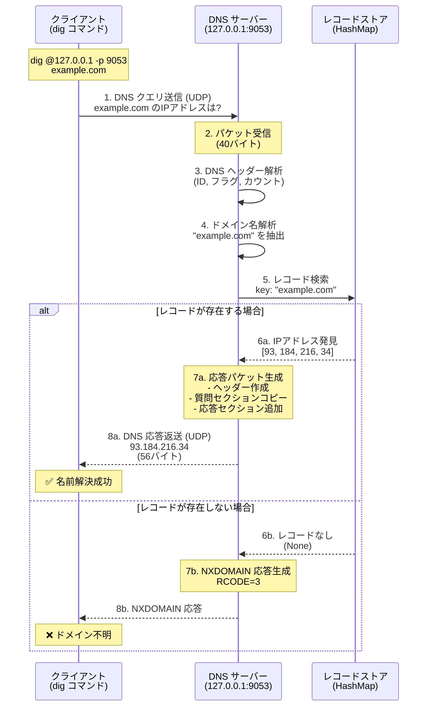
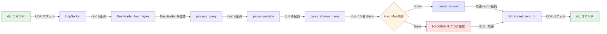

# DNS サーバー 使い方ガイド 🌐

## 概要

Rust でゼロから実装した簡易 DNS サーバーです。UDP 通信で DNS クエリを受信し、登録されたドメイン名に対応する IPv4 アドレスを返します。

## 名前解決の流れ

### シーケンス図



### フローチャート（詳細処理）

```mermaid
flowchart TD
    Start([dig コマンド実行]) --> SendQuery[DNS クエリ送信<br/>UDP:9053]
    SendQuery --> Receive[サーバーがパケット受信<br/>buf: 512バイト配列]

    Receive --> ParseHeader[DNS ヘッダー解析<br/>12バイト読み込み]
    ParseHeader --> ExtractID[トランザクションID抽出]
    ExtractID --> ExtractFlags[フラグ情報抽出]
    ExtractFlags --> ExtractCounts[カウント情報抽出<br/>QDCOUNT, ANCOUNT等]

    ExtractCounts --> ParseQuestion[質問セクション解析<br/>12バイト目から]
    ParseQuestion --> ParseDomain[ドメイン名パース]

    ParseDomain --> LabelLoop{ラベル処理ループ}
    LabelLoop -->|長さ > 0| ReadLabel[ラベル読み込み<br/>長さバイト分]
    ReadLabel --> LabelLoop
    LabelLoop -->|長さ = 0| DomainComplete[ドメイン名完成<br/>ラベルを'.'で結合]

    DomainComplete --> ExtractType[クエリタイプ抽出<br/>A=1]
    ExtractType --> ExtractClass[クエリクラス抽出<br/>IN=1]

    ExtractClass --> SearchRecord{HashMap検索<br/>ドメイン名で検索}

    SearchRecord -->|見つかった| BuildAnswer[応答パケット構築]
    BuildAnswer --> CopyHeader[応答ヘッダー作成<br/>flags=0x8180<br/>ANCOUNT=1]
    CopyHeader --> CopyQuestion[質問セクションコピー]
    CopyQuestion --> AddAnswer[応答セクション追加]
    AddAnswer --> EncodeDomain[ドメイン名エンコード]
    EncodeDomain --> AddType[TYPE: A=1]
    AddType --> AddClass[CLASS: IN=1]
    AddClass --> AddTTL[TTL: 300秒]
    AddTTL --> AddIP[IPアドレス追加<br/>4バイト]
    AddIP --> SendResponse[UDP で応答送信]

    SearchRecord -->|見つからない| BuildNXDomain[NXDOMAIN 応答構築<br/>flags|=0x0003<br/>ANCOUNT=0]
    BuildNXDomain --> SendResponse

    SendResponse --> LogComplete[ログ出力:<br/>✅ 応答送信完了]
    LogComplete --> WaitNext[次のクエリ待機]
    WaitNext --> Receive

    style Start fill:#e1f5e1
    style SendResponse fill:#ffe1e1
    style LogComplete fill:#e1e5ff
    style SearchRecord fill:#fff4e1
```

### データフロー図



## 主な機能

- ✅ DNS クエリの受信・解析
- ✅ DNS ヘッダーの処理
- ✅ ドメイン名のパース（ラベル形式）
- ✅ A レコード（IPv4 アドレス）の応答
- ✅ NXDOMAIN（存在しないドメイン）の処理
- ✅ HashMap によるレコード管理

## 技術仕様

### 実装内容

- **プロトコル**: DNS over UDP
- **ポート**: 9053 (通常の DNS は 53 番ですが、権限が必要なため変更)
- **レコードタイプ**: A (IPv4 アドレス)
- **TTL**: 300 秒

### DNS パケット構造

```
+------------------+
|   DNSヘッダー    |  12バイト
+------------------+
|  質問セクション  |  可変長
+------------------+
|  応答セクション  |  可変長（応答時のみ）
+------------------+
```

## セットアップ

### 1. プロジェクトの準備

`src/main.rs` に以下を追加:

```rust
mod dns_server;

fn main() {
    dns_server::run();
}
```

### 2. サーバーの起動

```bash
cargo run
```

起動すると以下のように表示されます:

```
🚀 DNS Server started on 127.0.0.1:9053
📋 登録されているレコード:
  localhost -> 127.0.0.1
  test.local -> 192.168.1.100
  example.com -> 93.184.216.34
  myserver.local -> 10.0.0.50

⏳ クエリを待機中...
```

## 使い方

### サーバーの停止方法

DNS サーバーを停止するには、以下のいずれかの方法を使用します:

#### 方法 1: Ctrl+C で停止（推奨）

サーバーが実行中のターミナルで:

```bash
# Ctrl+C を押す
^C
```

#### 方法 2: プロセス ID で停止

```bash
# プロセスを確認
ps aux | grep "target/debug/app" | grep -v grep

# 出力例:
# katayama8000  82134  0.0  0.0  435299808  6976  s017  SN  12:13午後  0:00.25 target/debug/app

# プロセスIDを指定して停止
kill 82134

# または、強制終了する場合
kill -9 82134
```

#### 方法 3: ワンライナーで停止

```bash
# DNSサーバープロセスを自動で検出して停止
pkill -f "target/debug/app"

# または
killall app
```

#### 方法 4: ポート番号から停止

```bash
# ポート9053を使用しているプロセスを停止
lsof -ti :9053 | xargs kill

# 強制終了の場合
lsof -ti :9053 | xargs kill -9
```

### サーバーの状態確認

```bash
# サーバーが起動しているか確認
ps aux | grep "target/debug/app" | grep -v grep

# ポートがリスニング中か確認
lsof -i :9053

# または
netstat -an | grep 9053
```

### 基本的なクエリ

別のターミナルを開いて、以下のコマンドを実行します:

#### dig コマンドを使用

```bash
# example.com のIPアドレスを取得
dig @127.0.0.1 -p 9053 example.com

# localhost のIPアドレスを取得
dig @127.0.0.1 -p 9053 localhost

# test.local のIPアドレスを取得
dig @127.0.0.1 -p 9053 test.local

# 簡潔な出力（IPアドレスのみ）
dig @127.0.0.1 -p 9053 example.com +short
```

#### nslookup コマンドを使用

```bash
nslookup -port=9053 example.com 127.0.0.1
```

### 実行例

```bash
$ dig @127.0.0.1 -p 9053 example.com +short
93.184.216.34
```

サーバー側のログ:

```
📨 受信: 40 バイトのクエリ from 127.0.0.1:62773
🔍 クエリID: 12458, Questions: 1
🔎 クエリ: example.com (type: 1)
✨ レコードが見つかりました!
📤 送信: 56 バイトの応答 to 127.0.0.1:62773
✅ 応答送信完了
```

## 登録されているレコード

デフォルトで以下のレコードが登録されています:

| ドメイン名       | IP アドレス   | 説明                    |
| ---------------- | ------------- | ----------------------- |
| `example.com`    | 93.184.216.34 | サンプルドメイン        |
| `localhost`      | 127.0.0.1     | ローカルホスト          |
| `test.local`     | 192.168.1.100 | テスト用プライベート IP |
| `myserver.local` | 10.0.0.50     | カスタムサーバー        |

## レコードの追加方法

`src/dns_server.rs` の `new` メソッド内でレコードを追加できます:

```rust
pub fn new(bind_addr: &str) -> Result<Self, std::io::Error> {
    let socket = UdpSocket::bind(bind_addr)?;
    let mut records = HashMap::new();

    // 新しいレコードを追加
    records.insert("mycustom.local".to_string(), vec![192, 168, 0, 1]);

    // ...
}
```

## カスタマイズ

### ポート番号の変更

`run()` 関数内のポート番号を変更:

```rust
match DnsServer::new("127.0.0.1:5353") {  // 5353に変更
    // ...
}
```

### TTL の変更

`create_answer()` メソッド内の TTL 値を変更:

```rust
// TTL (Time To Live: 3600秒 = 1時間)
answer.extend_from_slice(&3600u32.to_be_bytes());
```

## トラブルシューティング

### ポート使用中エラー

```
❌ サーバーの起動に失敗: Address already in use (os error 48)
```

**解決方法**:

1. 既存のプロセスを終了
2. 別のポート番号を使用

### DNS 解決が失敗する

- サーバーが起動しているか確認
- ポート番号が正しいか確認
- ファイアウォールの設定を確認

## コード構造

```
dns_server.rs
├── DnsHeader       # DNSヘッダー構造
├── RecordType      # レコードタイプ定義
├── DnsQuery        # クエリ情報
└── DnsServer       # メインのサーバー実装
    ├── new()                 # サーバー初期化
    ├── run()                 # メインループ
    ├── process_query()       # クエリ処理
    ├── parse_question()      # 質問セクション解析
    ├── parse_domain_name()   # ドメイン名解析
    └── create_answer()       # 応答パケット生成
```

## 技術的な詳細

### DNS ヘッダーフォーマット

```
 0  1  2  3  4  5  6  7  8  9  0  1  2  3  4  5
+--+--+--+--+--+--+--+--+--+--+--+--+--+--+--+--+
|                      ID                       |
+--+--+--+--+--+--+--+--+--+--+--+--+--+--+--+--+
|QR|   Opcode  |AA|TC|RD|RA|   Z    |   RCODE   |
+--+--+--+--+--+--+--+--+--+--+--+--+--+--+--+--+
|                    QDCOUNT                    |
+--+--+--+--+--+--+--+--+--+--+--+--+--+--+--+--+
|                    ANCOUNT                    |
+--+--+--+--+--+--+--+--+--+--+--+--+--+--+--+--+
|                    NSCOUNT                    |
+--+--+--+--+--+--+--+--+--+--+--+--+--+--+--+--+
|                    ARCOUNT                    |
+--+--+--+--+--+--+--+--+--+--+--+--+--+--+--+--+
```

### ドメイン名のエンコード

ドメイン名は「ラベル」形式でエンコードされます:

```
example.com → 7 e x a m p l e 3 c o m 0
              ↑                 ↑       ↑
           長さ(7)          長さ(3)   終端
```

## 参考資料

- [RFC 1035 - Domain Names Implementation and Specification](https://www.rfc-editor.org/rfc/rfc1035)
- [DNS Query Format](https://datatracker.ietf.org/doc/html/rfc1035#section-4.1)
- [DNS Message Compression](https://datatracker.ietf.org/doc/html/rfc1035#section-4.1.4)

## ライセンス

このコードはサンプル実装です。学習・研究目的で自由にご利用ください。

## 注意事項

⚠️ **本番環境での使用について**

この DNS サーバーは教育目的の簡易実装です。以下の機能は実装されていません:

- DNS 圧縮（ポインタ）
- 複数質問の処理
- AAAA、MX、CNAME などの他のレコードタイプ
- DNSSEC
- ゾーン転送
- 再帰的クエリ
- キャッシング

本番環境では、BIND、Unbound、PowerDNS などの実績のある DNS サーバーを使用してください。
